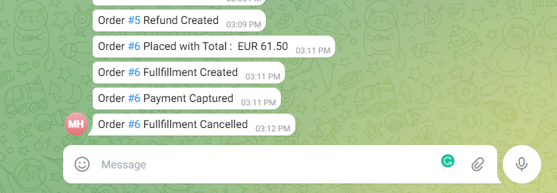

# Order Notifications to Telegram



### Demo
https://user-images.githubusercontent.com/1390862/196410106-90fe506e-dde9-4333-9db1-20fcd3a74240.mp4

## Description
All order related events pushed to telegram group so that user can see the highlights. User can navigte to  link to get more order details.


## Set up Project

### Prerequisites
- Medusa Backend/Frontend/admin Setup
- [Telegram Bot Token](https://telegram.me/BotFather)
- Add Bot to Telegram Group
- [Telegram group Chat Id](https://stackoverflow.com/questions/32423837/telegram-bot-how-to-get-a-group-chat-id#answer-69302407)

### Installation
- Clone this repo
- Configure below paramers in backend medsa-config.js file
```js
  {
    resolve: `medusa-notification-telegram`,
    options: {
      token: process.env.TELEGRAM_TOKEN || 'xxxxxxxxxxxx',
      group_chat_id: process.env.TELEGRAM_GROUP_CHAT_ID || '-100xxxxxxxx',      
      admin_orders_url: 'http://localhost:7000/a/orders',
      events_notifications: [
            "order.placed" , "order.return_requested" ,"order.fulfillment_created" ,"order.shipment_created" ,
            "order.payment_captured", "order.canceled", "order.updated" , "order.swap_created",
            "order.refund_failed", "order.refund_created" , "order.return_action_required", "order.items_  returned",
            "order.fulfillment_canceled"
          ]
    }

```
- add local package using [npm link](https://docs.medusajs.com/advanced/backend/plugins/create/#test-your-plugin) with backend repo
- setup REDIS_URL in projectConfig, For notification queue

## Resources
- https://docs.medusajs.com/usage/local-development/
- https://docs.medusajs.com/advanced/backend/plugins/create/
- https://github.com/yagop/node-telegram-bot-api
- https://core.telegram.org/schema
